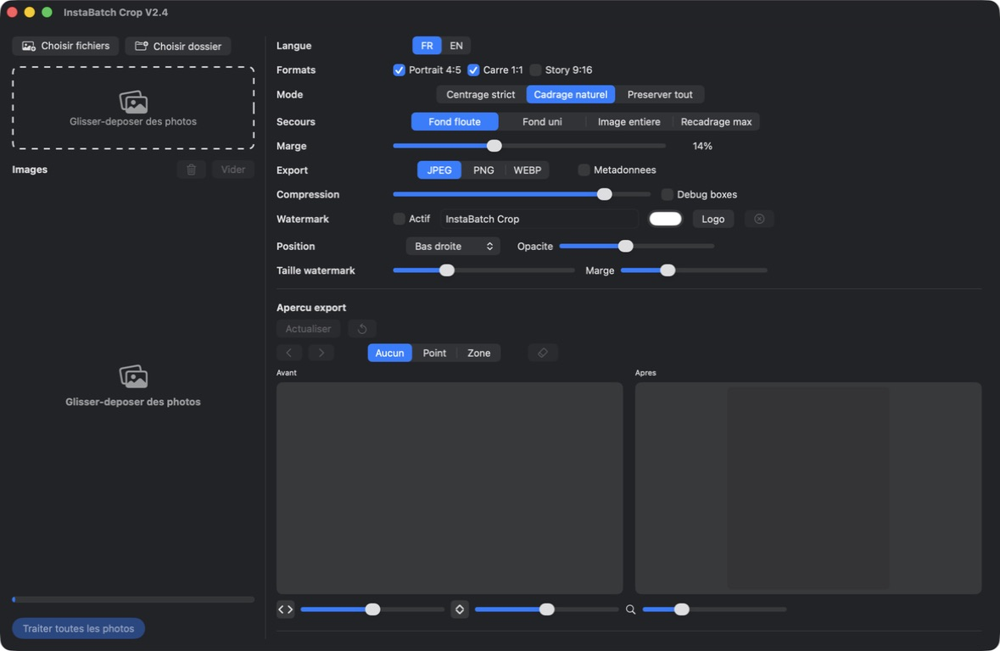

# InstaBatch Crop

<p align="center">
  
</p>

Native macOS app for batch-cropping images to Instagram formats while keeping important subjects inside the frame.



## Download

- [Download the macOS app V2.0 directly](https://github.com/bizc0m/InstaBatchCrop/releases/download/v2.0/InstaBatch-Crop-V2.0.app.zip)
- Release page: [v2.0](https://github.com/bizc0m/InstaBatchCrop/releases/tag/v2.0)
- Compiled app in the repository: `dist/2.0/InstaBatch Crop V2.0.app`
- ZIP archive: `dist/2.0/InstaBatch-Crop-V2.0.app.zip`

Note: if the GitHub repository is private, the direct download link only works for authorized GitHub accounts.

## Quick Start

1. Open `dist/2.0/InstaBatch Crop V2.0.app`.
2. If macOS blocks the app, right-click it and choose `Open`.
3. Drag and drop photos into the left panel.
4. Select the Instagram formats you need.
5. Click `Traiter toutes les photos` / `Process all photos`.

Source files are never modified. The app creates an export folder next to the original images.

## Features

- Instagram formats: portrait 4:5, square 1:1, story 9:16.
- Import files, folders, or drag-and-drop images.
- Image queue with selection, removal, and full cleanup.
- Local Vision analysis: faces, human bodies, animals when available, saliency.
- Manual focus points and focus zones per image.
- Before / after export preview.
- Direct crop movement inside the after preview.
- Crop adjustment with arrow controls and zoom.
- JPEG, PNG, and WebP export.
- `Compression` control for JPEG.
- Optional text watermark: color, position, opacity, size, margin.
- Optional transparent image/logo watermark.
- FR / EN interface.
- Standalone ad hoc signed macOS app.

## Documentation

- [Install](docs/INSTALL.md)
- [User guide](docs/USER_GUIDE.md)
- [Versions and releases](docs/RELEASES.md)
- [Changelog](CHANGELOG.md)
- [Reddit post draft](docs/REDDIT_POST.md)

## Repository Structure

```text
InstaBatchCrop/
├── InstaBatchCrop/          # SwiftUI interface
├── InstaBatchCropCore/      # Crop engine, export, watermark
├── InstaBatchCropTests/     # Unit and integration tests
├── assets/
│   ├── icon.png             # GitHub-visible icon
│   ├── AppIcon.png          # Source app icon
│   ├── AppIcon.icns         # macOS app icon
│   └── screenshots/         # README screenshots
├── dist/
│   ├── 0.7/                 # Preserved older release
│   ├── 1.54/
│   └── 2.0/                 # Current stable version
├── docs/
└── logs/
```

## Build from Source

Requirements: macOS with Xcode 26.x or Swift 6.x.

```bash
cd /Users/JOB/#DEV/02-apps/InstaBatchCrop
swift test
xcodebuild -scheme InstaBatchCrop -destination 'platform=macOS' build
```

In Xcode: open `Package.swift`, then run the `InstaBatchCrop` scheme.

## Tests

Locally validated command:

```bash
swift test
```

Known v2.0 result: 19 tests passing.

## Technical Notes

- `Compression` is meaningful for JPEG.
- PNG is lossless and ignores ImageIO quality compression.
- WebP may interpret the value depending on the ImageIO support available on macOS.
- Watermark rendering is local and does not use any external service.
- The app is ad hoc signed locally, but not Apple-notarized.
